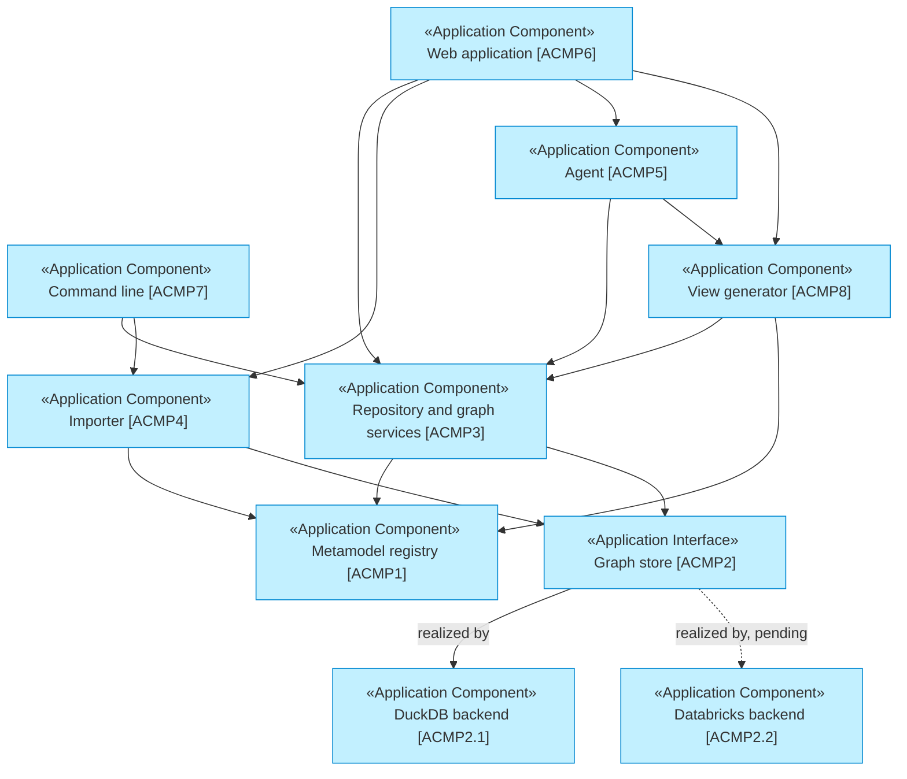

# Application Layer

_[← EA home](../README.md)_

The software: the services the repository offers, the components providing
them, and where each component lives in the code. Two documents are enough at
this size; collaborations, solution design and interface contracts are folded
into the components document until the component count justifies more.

## Analysis order

| #   | Document | Elements | Question it answers |
| --- | -------- | -------- | ------------------- |
| 1   | [1_application-services.md](./1_application-services.md) | Application Services | What does the software offer its users and the agents? |
| 2   | [2_application-components.md](./2_application-components.md) | Application Components, mapped to source files, with the layering rule and the dependency diagram | Which components provide those services, and how do they depend on each other? |

`2_application-components.md` is where the **grounding rule** bites hardest:
every component row points at the module that implements it, and a component
that does not exist yet is marked **Pending** with the initiative that will
build it.

## Layer view

